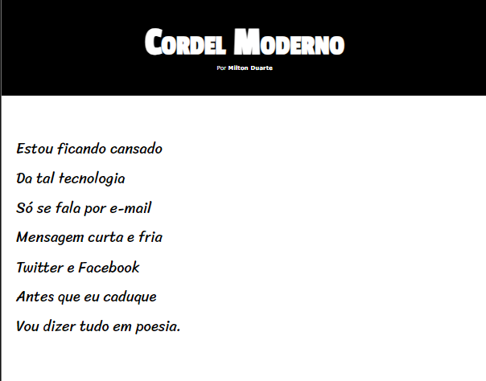
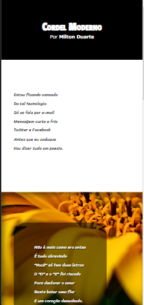

# Projeto Cordel Moderno

" Tenho saudade das cartas    
  escritas com a própria mão  
  mandava no mês de Junho  
  só chegava no verão "

O Projeto  tem como objetivo apresentar o Cordel Moderno do poeta Milton Duarte de uma forma criativa.  

| Vitrine_Dev     |    |
| ---------- | --- |
| ⭐ Nome  | **Cordel Moderno**
| 🛠️ Tecnologias    | HTML , CSS 
| 🔗 URL  | https://karoltoledo.github.io/projeto-cordel/ 

**Telas grandes**

**Formato mobile**      

## Site original
[Clique aqui para abrir o site original](https://www.recantodasletras.com.br/poesias/3186743)
